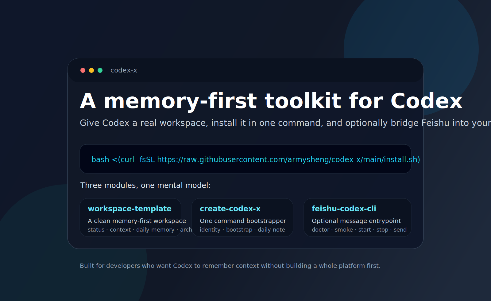
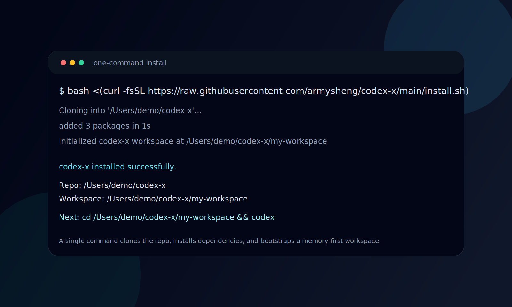
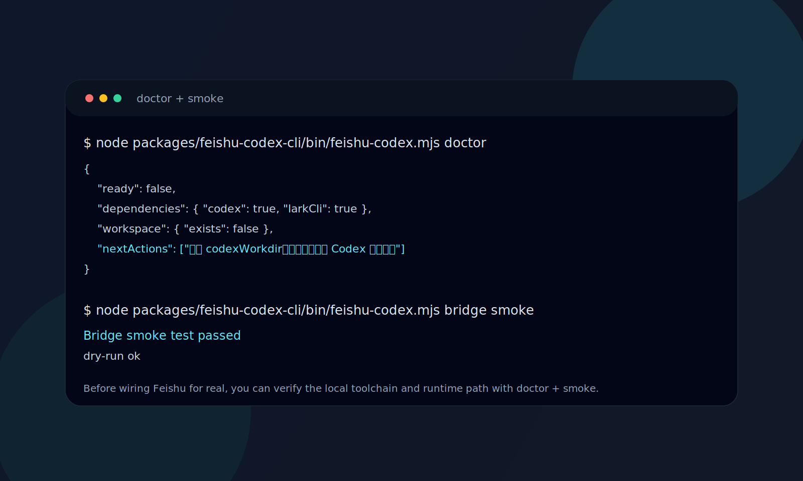
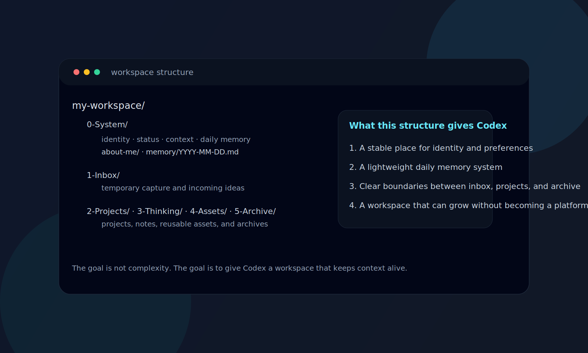
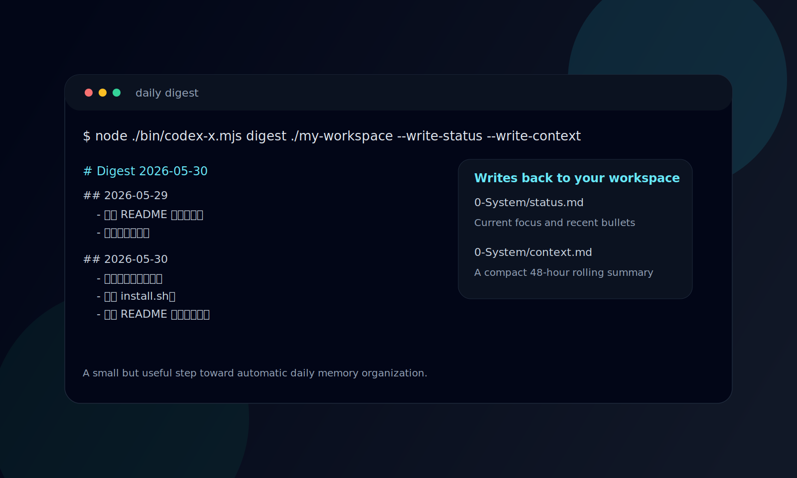

# codex-x

简体中文 | [English](./README.en.md)

[](https://github.com/armysheng/codex-x/stargazers)
[](https://github.com/armysheng/codex-x/releases)
[](./LICENSE)
[](https://github.com/armysheng/codex-x)











`codex-x` 是一个给 Codex 用的本地工作区工具箱。

它解决的是这几个很实际的问题：

- 每次开新会话，AI 都像失忆了一样
- 想让 Codex 记住你、记住项目、记住阶段上下文，但不想搭数据库
- 想把飞书消息桥接到本地 Codex，又不想一开始就上复杂平台

它不是一个“大而全 AI 平台”，而是把 3 件事拆清楚：

- 给 Codex 一个**能长期记住上下文**的工作区
- 给用户一个**一条命令就能装起来**的初始化入口
- 给需要消息入口的人一个**可选的飞书桥接 CLI**

## 一条命令安装

```bash
bash <(curl -fsSL https://raw.githubusercontent.com/armysheng/codex-x/main/install.sh)
```

这条命令会：

1. 拉取 `codex-x`
2. 安装依赖
3. 初始化一个默认工作区

如果你想让 Codex 代你安装，直接把这句丢给它也行。

## 一句话解释

> `codex-x` = 一个带记忆系统的 Codex 工作区骨架 + 一个初始化器 + 一个可选的飞书桥接入口。

## 为什么它值得被 star

因为它不是另一个“大而全 AI 框架”，而是一个更容易真正用起来的组合：

1. **Memory-first**
   把 `status / context / daily memory / long-term memory` 这套结构直接变成可用工作区。

2. **Codex-native**
   不要求你离开本地开发流，不要求你先搭后端。

3. **Low-friction**
   先把最小闭环跑通，再按需接飞书桥接。

4. **Extensible without over-engineering**
   顶层只有 3 个功能包，但后面还能继续长。

## 为什么不是别的方案

| 方案 | 问题 | `codex-x` 的取舍 |
|---|---|---|
| 纯 prompt / 单个 AGENTS 文件 | 很快失去阶段上下文 | 直接给你 `status / context / daily memory / long-term memory` 的文件结构 |
| 一开始就上数据库 / SaaS | 太重，很多人用不起来 | 先本地优先，先跑通最小闭环 |
| 只做桥接机器人 | 能发消息，但不记项目 | 桥接只是入口，工作区记忆才是核心 |
| 大而全 AI 平台 | 学习成本高，定制度低 | 只保留现在真的存在的 3 个能力包 |

## 三个模块分别做什么

| 模块 | 它解决什么 | 你什么时候需要它 |
|---|---|---|
| `workspace-template` | 给 Codex 一个默认可用的记忆系统骨架 | 你想让 Codex 记住“你是谁、项目到哪一步了、最近做过什么” |
| `create-codex-x` | 把模板真正初始化成一个可用工作区 | 你不想手动复制目录和改文件，想一条命令完成安装 |
| `feishu-codex-cli` | 把飞书作为消息入口接到本地 Codex | 你已经有本地工作区，想从飞书发消息驱动它 |

更直接一点：

- **只想让 Codex 有记忆**：用 `workspace-template`
- **想快速装起来**：用 `create-codex-x`
- **想把飞书接进来**：再加 `feishu-codex-cli`

当前 `feishu-codex-cli` 已支持：

- `init`
- `doctor`
- `bridge start`
- `bridge status`
- `bridge logs`
- `bridge stop`
- `bridge smoke`
- `send`

另外，`create-codex-x` 现在还带了一个很实用的能力：

- `digest`
  用来整理今天/昨天的 daily memory，并可选回写 `status.md` / `context.md`

## 手动安装（如果你想自己控制每一步）

### 1. 安装依赖

```bash
cd codex-x
npm install
```

### 2. 初始化一个工作区

```bash
node ./bin/codex-x.mjs init \
  --answers examples/bootstrap.answers.example.json \
  ./tmp/my-workspace
```

如果后续把包发布出去，这条路径会收敛成：

```bash
npx create-codex-x my-workspace
cd my-workspace
codex
```

## 直接丢给 Codex

如果你想让 Codex 直接帮你装，不想自己记命令，可以把下面这段原样丢给它：

```text
请在当前仓库根目录执行：

1. `bash <(curl -fsSL https://raw.githubusercontent.com/armysheng/codex-x/main/install.sh)`
2. 告诉我安装后的 repo 目录和 workspace 目录
3. 提醒我下一步进入 workspace 后运行 `codex`
```

如果你想走交互式初始化，把第 2 步换成：

```text
`node ./bin/codex-x.mjs init ./tmp/my-workspace`
```

### 3. 可选：接飞书桥接

```bash
node packages/feishu-codex-cli/bin/feishu-codex.mjs init --write-config
node packages/feishu-codex-cli/bin/feishu-codex.mjs doctor
node packages/feishu-codex-cli/bin/feishu-codex.mjs bridge smoke
```

当前第一版的真实桥接主路径依赖：

- `lark-cli` 已登录 profile
- 本地可用的 `codex`
- 一个存在的 `codexWorkdir`

## 每天自动整理（最小版）

如果你想把今天/昨天的 daily memory 快速整理成摘要，可以直接跑：

```bash
node ./bin/codex-x.mjs digest ./tmp/my-workspace --write-status --write-context
```

这会：

- 读取最近两天的 `0-System/memory/*.md`
- 生成一段 digest
- 可选回写 `status.md`
- 可选回写 `context.md`

## 仓库结构

项目刻意收成 3 个功能包：

```text
packages/
├── workspace-template/
├── create-codex-x/
└── feishu-codex-cli/
```

这样组织的目的很简单：

- 顶层只表达现在真的存在的 3 个能力
- 每个能力都能独立理解，不需要先懂整个平台
- 以后要扩更多入口时，再从包内抽共享层，不提前过度设计

## 适合谁

- 想把 Codex 真正变成日常搭子的开发者
- 想让 AI 记住项目上下文，但不想先搭一套数据库/平台的人
- 想把本地工作区和飞书消息打通的人
- 想复用一套可公开、可迁移、可扩展的 AI 工作区骨架的人

## 典型场景

- 你每天都在同一个仓库里和 Codex 协作，但不想每次重新解释背景
- 你想让 AI 记住“这个项目现在推进到哪一步了”
- 你想把“工作区里的上下文”和“消息入口”接起来，而不是把它们拆成两套系统
- 你想先跑通最小闭环，再决定后面要不要做更重的平台化

## 当前状态

当前版本已经具备这些可验证能力：

- 初始化器能生成完整工作区
- `BOOTSTRAP` 会自动归档
- Feishu CLI 具备配置、自检、起停、状态、日志和 smoke 检查
- 全量测试已覆盖主链路

## FAQ

### 这是不是另一个 AI agent 平台？

不是。它更像一个 **Codex 工作区工具箱**。

重点不是“托管一切”，而是把这几件事做好：

- 让工作区有记忆
- 让初始化足够顺
- 让消息入口能接进来

### 我不用飞书，能用吗？

可以。

飞书 CLI 是可选模块。只想用记忆系统和初始化器，直接用：

```bash
node ./bin/codex-x.mjs init ...
```

就够了。

### 为什么只保留 3 个模块？

因为当前真正存在、而且用户真的会直接接触到的能力就 3 个：

- `workspace-template`
- `create-codex-x`
- `feishu-codex-cli`

先把这 3 个模块讲清楚、做好用，比一开始拆成很多抽象层更健康。

### 这个项目现在最缺什么？

最缺的是：

- 一份更直观的 demo / GIF / screenshot
- 一次真正的飞书消息端到端公开演示
- 更平滑的安装路径（比如未来真正发布到 npm）

## 验证

```bash
cd codex-x
npm test
node ./scripts/check-redactions.mjs
```

## 文档

- [Getting Started](./docs/getting-started.md)
- [Codex Integration](./docs/codex-integration.md)
- [Memory Model](./docs/memory-model.md)
- [Feishu Setup](./docs/feishu-setup.md)
- [FAQ](./docs/faq.md)
- [Positioning](./docs/positioning.md)
- [Launch Kit](./docs/launch-kit.md)
- [Promotion Kit](./docs/promotion-kit.md)
- [Channel Posts](./docs/channel-posts.md)
- [Final Posts](./docs/final-posts.md)
- [First Week Checklist](./docs/first-week-checklist.md)
- [Discussion Template](./docs/discussion-template.md)
- [Metrics Tracker](./docs/metrics-tracker.md)
- [Next Steps](./NEXT_STEPS.md)
- [Screenshots Plan](./docs/screenshots.md)
- [Final Launch Plan](./docs/final-launch-plan.md)
- [Release Checklist](./docs/release-checklist.md)
- [Contributing](./CONTRIBUTING.md)

## Roadmap

- [ ] 真正跑通一次飞书消息 -> Codex -> 飞书回复的端到端链路
- [ ] 把 `workspace-template` 继续瘦成更纯的最小骨架
- [ ] 给 CLI 增加更友好的发布形态和安装路径
- [ ] 补一份公开 demo / GIF / screenshots

## License

MIT
